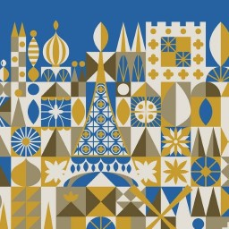
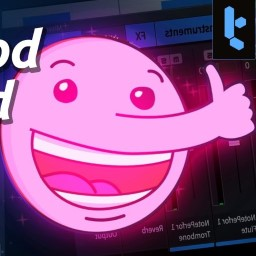

Here is a collection of some things that I like, relate to, and take inspiration from and why.

## Mary Blair

Influential modernist artist who worked directly with Walt Disney to give his films and theme parks attractions incredible visuals. I find the bold use of color and shape to be iconic and fit my tastes. Perhaps this site uses some of those ideas. [Learn more about Mary Blair](https://magicofmaryblair.com/mary-blair-gallery/).

## Tantacrule

Tantacrule or Martin Keary, is a Youtuber who focuses on music, software, and music software. This intersection is right up my alley and I really admire the insights he has, as well as his presentation style. He also designs a wonderful free music notation software called [MuseScore](https://musescore.org/). Check out his [Youtube channel](https://www.youtube.com/c/Tantacrul) or his [website](https://www.martinkeary.com/).